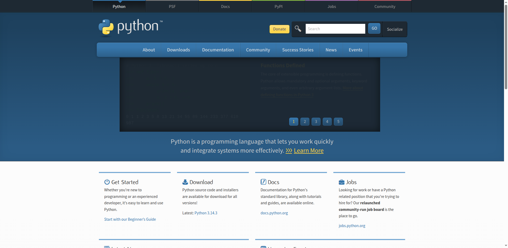
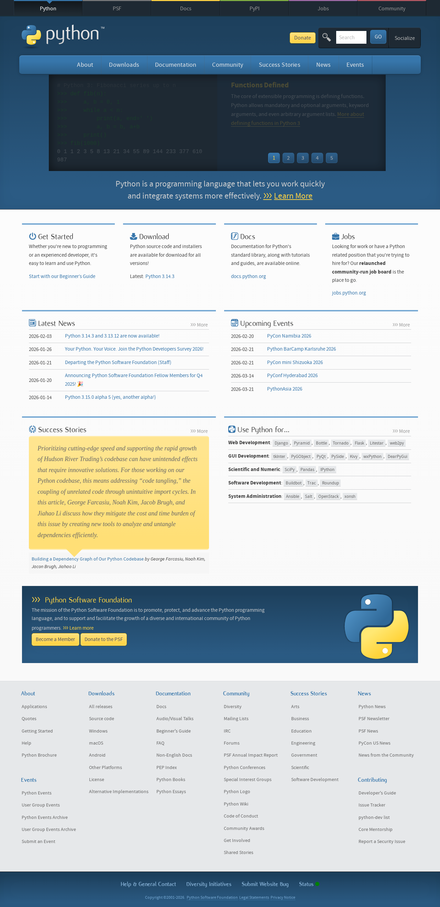
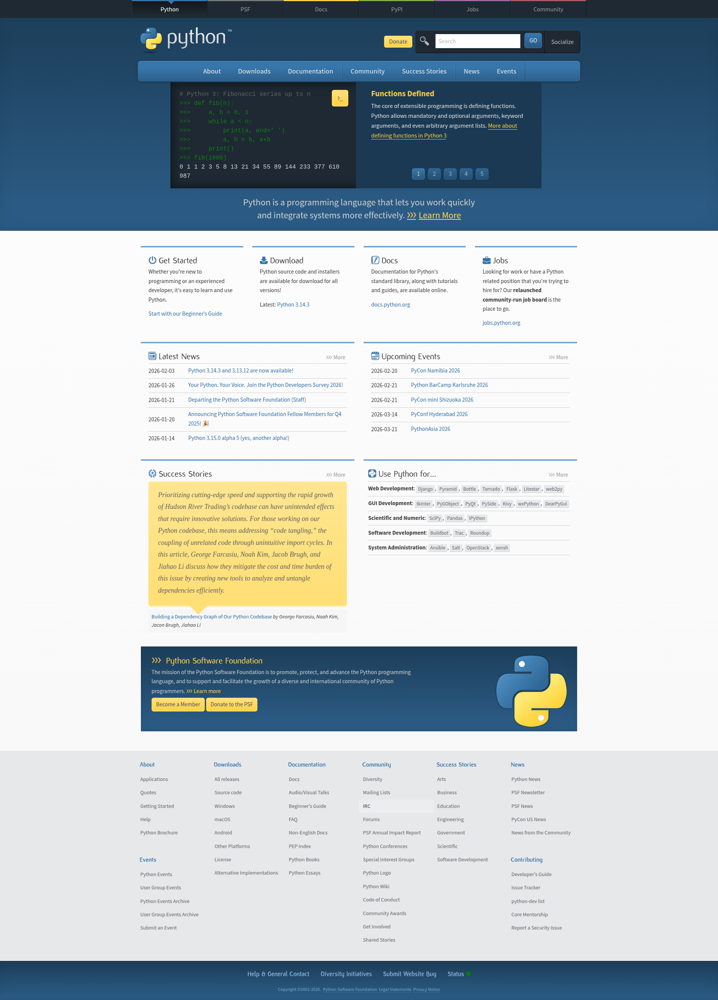

# PAGESHOOT
## Introduction

For various reasons, you may want a full take a screenshot of a full page for a certain webpage. However, for other reasons that is very hard to do. For example, if you use selenium it requires you to specify your height and width, which is not something you have or know. There are other tools, according to this [stackoverflow page](https://stackoverflow.com/questions/44085722/how-to-get-screenshot-of-full-webpage-using-selenium-and-java), however most such tools seem to be written in and or use a lot of javascript.

While there are some people who claim selenium is capable... This can be through "maximing viewport" and or using a "save_full_page_screenshoot()", this seems to be dependant on version (4+) and or which webdriver (geckodriver?) you are using, so does not seem too reliable. There also seems to be other approaches, such as saving [slices of screenshot](https://github.com/petersimeth/selenium-chrome-full-page-screenshot/blob/master/app.py), which is an intresting idea.

## Installation

This project is expected to be run in a devcontainer using the [VS Code Dev Containers extension](https://marketplace.visualstudio.com/items?itemName=ms-vscode-remote.remote-containers).

## Implementations

### selenium
Base Selenium screenshot functionality.

### playwright
Uses Playwright for pageshots.

### page_stitch
Uses Selenium to capture and stitch screenshot slices together into one pageshot.

